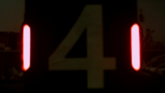
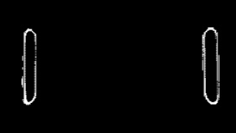
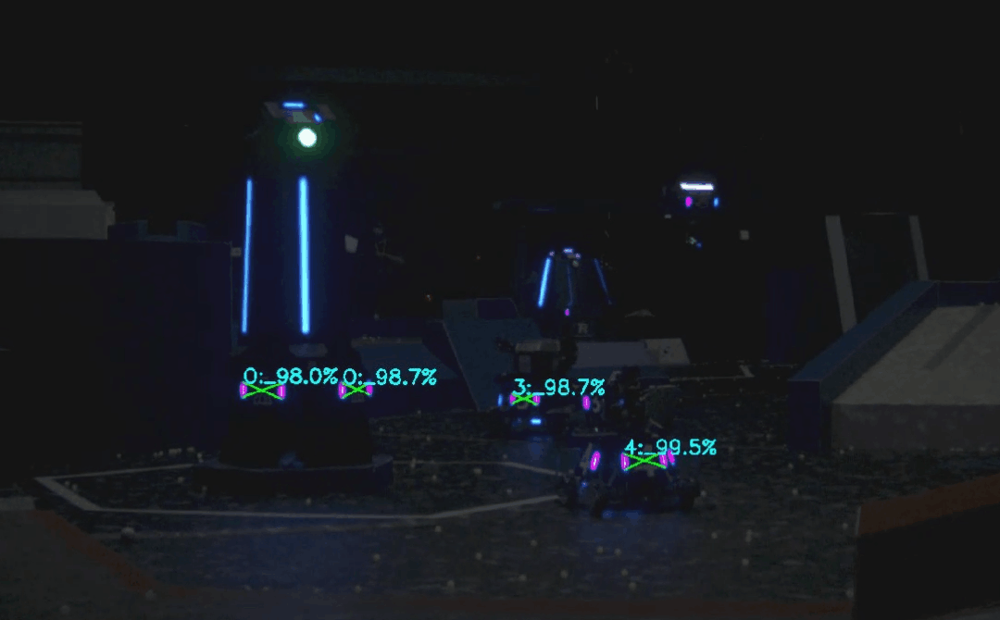

# armor_detector

- [DetectorNode](#basedetectornode)
  - [Detector](#detector)
    - [NumberClassifier](#numberclassifier)
  - [PnPSolver](#pnpsolver)

## 识别节点

订阅相机参数及图像流进行装甲板的识别并解算三维位置，输出识别到的装甲板在输入frame下的三维位置 (一般是以相机光心为原点的相机坐标系)

### DetectorNode
装甲板识别节点

包含[Detector](#detector)
包含[PnPSolver](#pnpsolver)

订阅：
- 相机参数 `/camera_info`
- 彩色图像 `/image_raw`

发布：
- 识别目标 `/detector/armors`

静态参数：
- 筛选灯条的参数 `light`
  - 长宽比范围 `min/max_ratio` 
  - 最大倾斜角度 `max_angle`
- 筛选灯条配对结果的参数 `armor`
  - 两灯条的最小长度之比（短边/长边）`min_light_ratio `
  - 装甲板两灯条中心的距离范围（大装甲板）`min/max_large_center_distance`
  - 装甲板两灯条中心的距离范围（小装甲板）`min/max_small_center_distance`
  - 装甲板的最大倾斜角度 `max_angle`

动态参数：
- 是否发布 debug 信息 `debug`
- 识别目标颜色 `detect_color`
- 二值化的最小阈值 `binary_thres`
- 数字分类器 `classifier`
  - 置信度阈值 `threshold`

## Detector
装甲板识别器

### preprocessImage
预处理

|  |  |  |
| :---------------: | :-------------------: | :--------------------: |
|       原图        |    通过颜色二值化     |     通过灰度二值化     |

由于一般工业相机的动态范围不够大，导致若要能够清晰分辨装甲板的数字，得到的相机图像中灯条中心就会过曝，灯条中心的像素点的值往往都是 R=B。根据颜色信息来进行二值化效果不佳，因此此处选择了直接通过灰度图进行二值化，将灯条的颜色判断放到后续处理中。

### findLights
寻找灯条

通过 findContours 得到轮廓，再通过 minAreaRect 获得最小外接矩形，对其进行长宽比和倾斜角度的判断，可以高效的筛除形状不满足的亮斑。

判断灯条颜色这里采用了对轮廓内的的R/B值求和，判断两和的的大小的方法，若 `sum_r > sum_b` 则认为是红色灯条，反之则认为是蓝色灯条。

|  |  |
| :---------------: | :----------------: |
| 提取出的红色灯条  |  提取出的蓝色灯条  |

### matchLights
配对灯条

根据 `detect_color` 选择对应颜色的灯条进行两两配对，首先筛除掉两条灯条中间包含另一个灯条的情况，然后根据两灯条的长度之比、两灯条中心的距离、配对出装甲板的倾斜角度来筛选掉条件不满足的结果，得到形状符合装甲板特征的灯条配对。

## NumberClassifier
数字分类器

### extractNumbers
提取数字

|  |  |  |  |
| :-------------------: | :--------------------: | :-------------------: | :-------------------: |
|         原图          |        透视变换        |         取ROI         |        二值化         |

将每条灯条上下的角点拉伸到装甲板的上下边缘作为待变换点，进行透视变换，再对变换后的图像取ROI。考虑到数字图案实质上就是黑色背景+白色图案，所以此处使用了大津法进行二值化。

### Classify
分类

由于上一步对于数字的提取效果已经非常好，数字图案的特征非常清晰明显，装甲板的远近、旋转都不会使图案产生过多畸变，且图案像素点少，所以我们使用多层感知机（MLP）进行分类。

网络结构中定义了两个隐藏层和一个分类层，将二值化后的数字展平成 20x28=560 维的输入，送入网络进行分类。

网络结构：

<!-- 效果图： -->

<!--  -->

## PnPSolver
PnP解算器

[Perspective-n-Point (PnP) pose computation](https://docs.opencv.org/4.x/d5/d1f/calib3d_solvePnP.html)

PnP解算器将 `cv::solvePnP()` 封装，接口中传入 `Armor` 类型的数据即可得到 `geometry_msgs::msg::Point` 类型的三维坐标。

考虑到装甲板的四个点在一个平面上，在PnP解算方法上我们选择了 `cv::SOLVEPNP_IPPE` (Method is based on the paper of T. Collins and A. Bartoli. ["Infinitesimal Plane-Based Pose Estimation"](https://link.springer.com/article/10.1007/s11263-014-0725-5). This method requires coplanar object points.)
