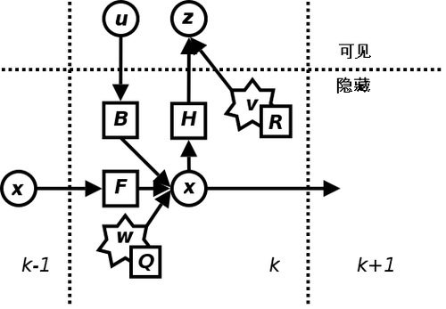

# armor_processor

- [armor_processor](#armor_processor)
  - [ArmorProcessorNode](#armorprocessornode)
  - [KalmanFilter](#kalmanfilter)
  - [Tracker](#tracker)
  - [SpinObserver](#spinoberserver)

## ArmorProcessorNode
装甲板处理节点

订阅识别节点发布的装甲板三维位置及机器人的坐标转换信息，将装甲板三维位置通过 `tf` 变换到指定惯性系下，然后将目标送入跟踪器中得到跟踪目标在指定惯性系下（一般是以云台中心为原点，IMU 上电时的 Yaw 朝向为 X 轴的惯性系）的位置及速度，再经过小陀螺状态检测器的处理后，发布最终的目标位置和速度

订阅：
- 已识别到的装甲板 `/detector/armors`
- 机器人的坐标转换信息 `/tf` `/tf_static`

发布：
- 最终锁定的目标 `/processor/target`

参数：
- 跟踪器参数 tracker
  - 两帧间目标可匹配的最大距离 max_match_distance
  - `DETECTING` 状态进入 `TRACKING` 状态的阈值 tracking_threshold
  - `TRACKING` 状态进入 `LOST` 状态的阈值 lost_threshold

## KalmanFilter

参考 OpenCV 中的卡尔曼滤波器使用 Eigen 进行了实现

[卡尔曼滤波器](https://zh.wikipedia.org/wiki/%E5%8D%A1%E5%B0%94%E6%9B%BC%E6%BB%A4%E6%B3%A2)

考虑到自瞄任务中对于目标只有观测没有控制，所以输入－控制模型 $B$ 和控制器向量 $u$ 可忽略。

预测及更新的公式如下：

预测：

$$ x_{k|k-1} = F * x_{k-1|k-1} $$

$$ P_{k|k-1} = F * P_{k-1|k-1}* F^T + Q $$

更新:

$$ K = P_{k|k-1} * H^T * (H * P_{k|k-1} * H^T + R)^{-1} $$

$$ x_{k|k} = x_{k|k-1} + K * (z_k - H * x_{k|k-1}) $$

$$ P_{k|k} = (I - K * H) * P_{k|k-1} $$

## Tracker

参考 [SORT(Simple online and realtime tracking)](https://ieeexplore.ieee.org/abstract/document/7533003/) 中对于目标匹配的方法，使用卡尔曼滤波器对单目标在三维空间中进行跟踪

在此跟踪器中，卡尔曼滤波器观测量为目标在指定惯性系中的位置（xyz），状态量为目标位置及速度（xyz+vx vy vz）

在对目标的运动模型建模为在指定惯性系中的匀速线性运动，即状态转移为 $x_{pre} = x_{post} + v_{post} * dt$

目标关联的判断依据为三维位置的 L2 欧式距离

跟踪器共有四个状态：
- `DETECTING` ：短暂识别到目标，需要更多帧识别信息才能进入跟踪状态
- `TRACKING` ：跟踪器正常跟踪目标中
- `TEMP_LOST` ：跟踪器短暂丢失目标，通过卡尔曼滤波器预测目标
- `LOST` ：跟踪器完全丢失目标

工作流程：

- init：

  跟踪器默认选择离相机光心最近的目标作为跟踪对象，选择目标后初始化卡尔曼滤波器，初始状态设为当前目标位置，速度设为 0

- update:

  首先由卡尔曼滤波器得到目标在当前帧的预测位置，然后遍历当前帧中的目标位置与预测位置进行匹配，若当前帧不存在目标或所有目标位置与预测位置的偏差都过大则认为目标丢失，重置卡尔曼滤波器。
  
  最后选取位置相差最小的目标作为最佳匹配项，更新卡尔曼滤波器，将更新后的状态作为跟踪器的结果输出

目标在小陀螺状态下的 trick：若当前帧的所有目标与预测位置的偏差都不符合条件，但又存在与跟踪对象相同数字的目标，则重置卡尔曼滤波器并选取相同数字的目标作为跟踪目标，卡尔曼滤波器初始状态中的速度设为上一跟踪目标的速度。通过这种方式，卡尔曼滤波器的状态向量中速度不会从 0 开始迭代，相当于认为目标是沿着车身旋转的切线方向线性运动

## SpinDetector

小陀螺状态检测器，通过简单的方法实现对目标小陀螺状态的判断，当目标进入小陀螺模式时限制云台运动并判断合适的开火时机

